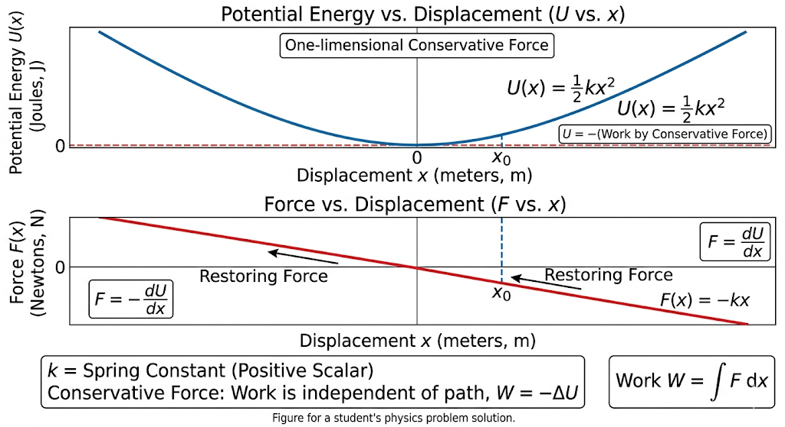

## Work of a Variable Force Analysis

**Given:** A one-dimensional force $F(x) = -kx$

---

### 1. Equation of Motion and Its Solution

**Equation of Motion:**
Using Newton's Second Law ($F = ma$), and knowing that acceleration $a$ is the second derivative of position with respect to time ($a = \frac{d^2x}{dt^2}$), we can write the equation of motion for a mass $m$ subjected to this force:
$$m\frac{d^2x}{dt^2} = -kx$$
$$\frac{d^2x}{dt^2} + \frac{k}{m}x = 0$$

**Solution:**
This is the standard second-order linear differential equation for Simple Harmonic Motion (SHM). Let $\omega = \sqrt{\frac{k}{m}}$ be the angular frequency. The equation becomes:
$$\frac{d^2x}{dt^2} + \omega^2x = 0$$

The general solution to this differential equation is:
$$x(t) = A\cos(\omega t + \phi)$$
*(Where $A$ is the amplitude and $\phi$ is the phase constant, both of which are determined by the initial conditions of the system).*

---

### 2. Work Done During Displacement

The work done ($W$) by a variable force along the x-axis from an initial position to a final position is the definite integral of the force with respect to displacement:
$$W = \int_{0}^{x_0} F(x) dx$$

Substitute the given force $F(x) = -kx$:
$$W = \int_{0}^{x_0} (-kx) dx$$
$$W = -k \left[ \frac{x^2}{2} \right]_{0}^{x_0}$$
$$W = -\frac{1}{2}kx_0^2$$

---

### 3. Interpretation as Potential Energy

For a conservative force, the work done by the force is equal to the negative change in potential energy ($\Delta U$):
$$W = -\Delta U = -(U_{final} - U_{initial})$$

If we define the reference point for potential energy at the origin such that $U(0) = 0$, then:
$$W = -(U(x_0) - U(0))$$
$$-\frac{1}{2}kx_0^2 = -U(x_0)$$
$$U(x_0) = \frac{1}{2}kx_0^2$$

This demonstrates that the potential energy $U$ stored in the system at any arbitrary position $x$ is $U(x) = \frac{1}{2}kx^2$.

---

### 4. Verifying the Relationship $F = -\frac{dU}{dx}$

We can verify the relationship between force and potential energy using our derived $U(x) = \frac{1}{2}kx^2$.

Take the derivative of $U(x)$ with respect to $x$ and multiply by $-1$:
$$-\frac{dU}{dx} = -\frac{d}{dx} \left( \frac{1}{2}kx^2 \right)$$
$$-\frac{dU}{dx} = -\frac{1}{2}k \cdot (2x)$$
$$-\frac{dU}{dx} = -kx$$

Since the result $-kx$ perfectly matches our initially given force $F(x)$, the relationship is verified.

---

### 5. Graphs of $F(x)$ and $U(x)$

*(To represent this in your notes or Codespace, you can use the following descriptions to sketch the graphs manually, or use plotting libraries like matplotlib in Python if you are generating them programmatically.)*

* **Graph of $F(x) = -kx$ (Force vs. Position):** * This is a **straight line** passing directly through the origin $(0,0)$.
    * It has a negative slope equal to $-k$. 
    * Physically, in the right quadrant (positive $x$), the force is negative (pulling the object back to the origin). In the left quadrant (negative $x$), the force is positive (pushing the object forward to the origin). This is characteristic of a restoring force.

* **Graph of $U(x) = \frac{1}{2}kx^2$ (Potential Energy vs. Position):**
    * This is an **upward-opening parabola**.
    * Its vertex rests exactly at the origin $(0,0)$, representing the point of minimum potential energy (the stable equilibrium point).
    * The curve is symmetric around the y-axis, indicating that the stored energy is positive and identical for both positive and negative displacements of the same magnitude.

    